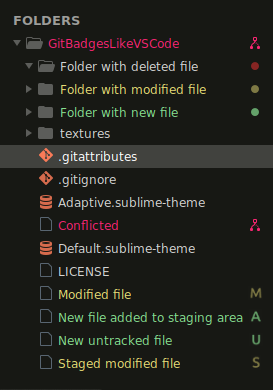

# git badges like VS Code

This plugin changes default Sublime Text git badges in left sidebar into VS Code looks.
Instead of dots and chevrons there are letters `A`, `M`, `S` and `U`. Also colors are changed.

Based on [OdatNurd's gist](https://gist.github.com/OdatNurd/4bb596e6162693567642b7aef4cab4c0)

## Install

Install as plugin via Package Control - TODO: add link when published

## How it looks

**Explanation:** 
- New files are **green** with `U` badge (untracked) or `A` badge when added to staging area
- Modified files are **yellow** with `M` badge when unstaged or `S` badge when staged
- Folder of deleted file has no color (red evoke error) but has **red** circle badge
- Conflicted file is **red** with git merge badge
- Folder has always circle badge (no letter or icon) except Conflicted

## Contribute

Contribution is welcome. Leave an Issue or Pull request
